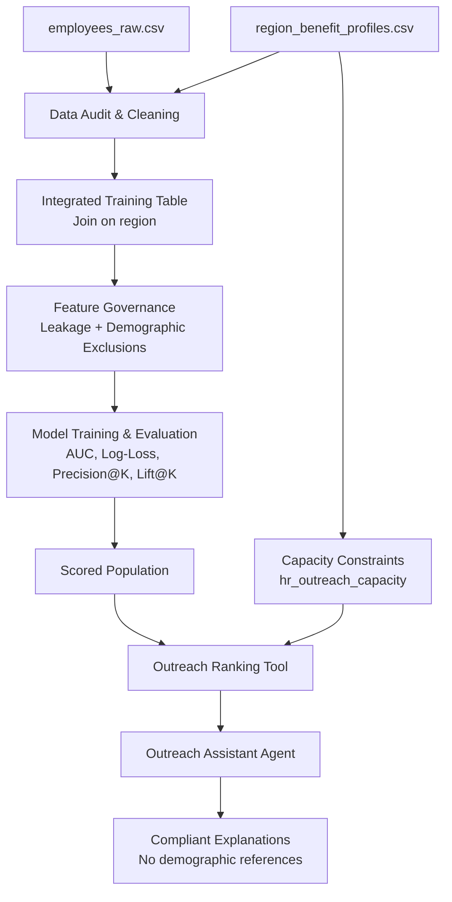

# Insurance Enrollment Prediction & Outreach Assistant Agent

## 1) Project Overview

This project defines an enterprise-grade machine learning and agentic decision-support architecture for **predicting voluntary insurance enrollment** and enabling **capacity-aware outreach planning** from operationally messy HR data.

The system is designed for:
- Reliable data quality handling (duplicates, sentinel values, malformed dates, dirty channels)
- Compliance-safe feature governance (explicit leakage and demographic exclusions)
- Business-aligned prioritization (Precision@K and Lift@K under regional outreach limits)
- Controlled agent behavior (refusal and explanation guardrails)

### Core Data Sources
- `employees_raw.csv`: employee-level records with enrollment outcomes and outreach history
- `region_benefit_profiles.csv`: regional constraints and context (including `hr_outreach_capacity`)

---

## 2) High-Level Architecture



ASCII alternative:

```text
Raw HR + Regional Profiles
        |
        v
Data Cleaning + Join Integrity
        |
        v
Feature Governance (No leakage, No protected demos)
        |
        v
Modeling + Evaluation
        |
        v
Scoring + Regional Capacity Constraints
        |
        v
Outreach Assistant Agent with Refusal Guardrails
```

---

## 3) Setup & Installation

From the project directory:

```bash
cd insurance_enrollment_agent
python -m venv .venv
source .venv/bin/activate  # On Windows: .venv\Scripts\activate
pip install -r requirements.txt
```

### Dependency Scope
The dependencies support tabular ML workflows, explainability, notebook analysis, schema validation, serialization, and testing.

---

## 4) Directory Structure and Module Responsibilities

```text
insurance_enrollment_agent/
├── data/
│   ├── raw/                  # Input datasets (source-of-truth CSV extracts)
│   └── processed/            # Cleaned and feature-ready datasets (gitignored)
├── src/
│   ├── __init__.py           # Package marker
│   ├── data_prep.py          # Data audit, cleaning, normalization, and joins
│   ├── feature_engineering.py# Feature transformations and feature policy enforcement
│   ├── train_model.py        # Model training, validation, and metric reporting
│   ├── agent_tools.py        # Tool interfaces used by the outreach assistant
│   └── agent_router.py       # Request routing and guardrail orchestration
├── notebooks/
│   └── agent_demo.ipynb      # Notebook for demonstration and stakeholder walkthrough
├── report.md                 # Technical design and compliance report
├── AI_USAGE.md               # AI tooling usage log and governance notes
├── requirements.txt          # Python dependency manifest
├── .gitignore                # Exclusions for data artifacts and local environments
└── README.md                 # Project overview, architecture, and operations guide
```

---

## 5) Operational Guidance

> **Note:** This repository scaffold defines architecture and interfaces. Module files are currently stubs and should be implemented according to the governance and design in `report.md`.

### 5.1 Data Cleaning Pipeline
Expected responsibilities in `src/data_prep.py`:
1. Resolve duplicate `employee_id` rows using deterministic conflict policy
2. Normalize heterogeneous date fields (`application_date`, `last_contact_date`)
3. Standardize categorical values (e.g., channel variants like `Email`, `EMAIL`, `e-mail`)
4. Interpret sentinel value `prior_year_enrolled = 1` as **new hire / no prior record**
5. Join with region profile data and validate key integrity

Planned execution pattern:

```bash
python -m src.data_prep
```

### 5.2 Feature Engineering and Training Pipeline
Expected responsibilities:
- Enforce forbidden-feature exclusions (`legacy_propensity_score`, regional target aggregates)
- Remove protected demographic fields from model inputs (`gender`, `marital_status`, `age`)
- Train and evaluate model with AUC-ROC, Log-Loss, Precision@K, and Lift@K

Planned execution pattern:

```bash
python -m src.feature_engineering
python -m src.train_model
```

### 5.3 Outreach Assistant Agent Runner
Expected responsibilities:
- Route tool calls and enforce refusal guardrails
- Prevent leakage-based queries
- Produce non-demographic, compliance-safe explanations

Planned execution pattern:

```bash
python -m src.agent_router
```

---

## 6) Governance and Compliance Summary

The architecture applies two mandatory controls:

1. **Target Leakage Refusal**
   - The system must refuse direct or indirect use of `legacy_propensity_score` and prohibited regional target aggregates.

2. **Protected Attribute Suppression in Explanations**
   - Agent explanations must not cite or imply protected demographic attributes (`gender`, `marital_status`, `age`).

For full policy rationale and implementation guidance, see `report.md`.

---

## 7) Documentation Index

- `report.md`: end-to-end technical and compliance design
- `AI_USAGE.md`: transparent log of AI-assisted architecture work and validation methodology
